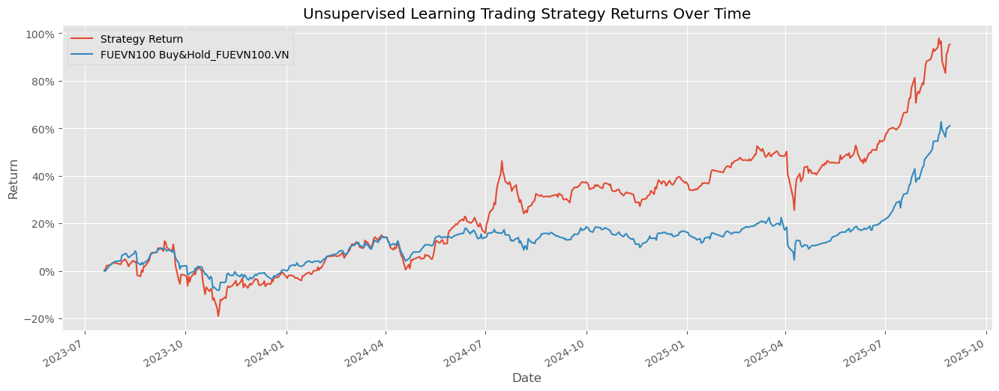

# Unsupervised Learning Trading Strategy (VN100 & VN30)

## 1. Project Overview

This project explores algorithmic trading on Vietnam’s VN100 and VN30 indices using unsupervised learning.

It applies K-Means clustering to group similar stocks, then optimizes portfolios using Modern Portfolio Theory (MPT) for maximum Sharpe ratio.

The strategy is rebalanced monthly and benchmarked against the VN30 index to test whether a systematic, data-driven approach can outperform passive investing.

## 2. Key Highlights

- **Data Pipeline** – Collects and cleans historical price data (Yahoo Finance), adjusts for splits/dividends.
- **Feature Engineering** – Computes volatility (Garman-Klass), RSI, Bollinger Bands, ATR, MACD, dollar volume, and monthly returns.
- **Machine Learning** – Clusters stocks monthly via K-Means after normalization.
- **Portfolio Optimization** – Allocates weights using MPT and performs monthly rebalancing.
- **Backtest & Visualization** – Compares portfolio performance vs VN30, visualizes clusters and risk-adjusted returns.

## 3. Skills & Business Impact

| Area | Tools Used | Value Delivered |
| --- | --- | --- |
| Data Analysis | Python, pandas, numpy | Clean and process VN100 & VN30 market data |
| Machine Learning | scikit-learn (K-Means) | Group stocks into meaningful clusters automatically |
| Portfolio Theory | PyPortfolioOpt | Optimize weights for maximum Sharpe ratio |
| Visualization | matplotlib | Present portfolio allocation and performance clearly |
| Research & Strategy | yfinance, statsmodels | Validate strategy viability in real markets |

**Business Value:**

- Removes emotional bias in stock selection.
- Creates reproducible, systematic investment strategy.
- Scalable to other indices or global markets.
- Demonstrates quant research, machine learning, and portfolio construction skills.

## 4. Result

