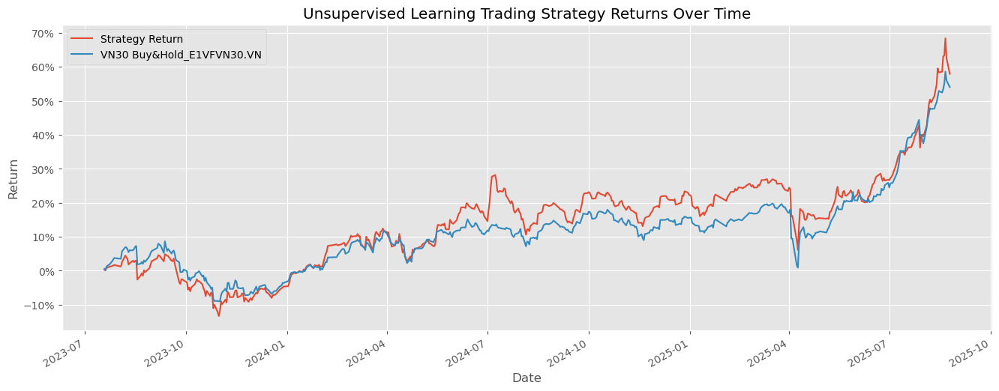

# Unsupervised Learning Portfolio: Vietnam Stock Market (VN100&VN30)

## Introduction
This project applies Unsupervised Learning techniques to analyze the Vietnam stock market (VN100). The objective is to cluster stocks, uncover hidden patterns, and support data-driven investment decisions. By grouping stocks with similar characteristics, investors can identify outperforming clusters, diversify portfolios, and enhance risk management.
### Significance
* Discover latent structures in the VN100 universe
* Support systematic portfolio construction
* Enable quantitative insights for investment strategies

## Project Workflow

### 1. Data Collection

* **Sources**: TradingView (VN100&VN30 components), Yahoo Finance (historical data), Fama-French Factors (via `pandas_datareader`)
* **Features Used**: Price, volume, RSI, Bollinger Bands, ATR, MACD, dollar volume (liquidity proxy), rolling returns, Fama-French factor exposures

### 2. Data Preprocessing

* **Cleaning**: Remove missing values, filter stocks with sufficient history
* **Aggregation**: Convert daily to monthly frequency, filter top 150 most liquid stocks
* **Feature Engineering**: Compute rolling returns, technical indicators, factor betas
* **Normalization**: Standardize features for clustering

### 3. Model Application

* **Clustering Algorithms**: K-Means (custom centroids based on RSI), Hierarchical Clustering (optional), PCA for dimensionality reduction
* **Portfolio Construction**: Select high-momentum clusters (e.g., RSI \~70), optimize weights using Efficient Frontier (PyPortfolioOpt)

### 4. Model Evaluation

* **Metrics**: Silhouette Score for cluster quality
* **Visualization**: Cluster scatter plots (RSI vs. returns), portfolio cumulative returns vs. VN100 benchmark

### 5. Final Output

* **Clusters**: Number and characteristics (momentum, volatility, factor exposure)
* **Insights**: Identification of outperforming clusters and diversification benefits
* **Portfolio Performance**: Strategy returns compared to VN100 Buy & Hold

---

## Mathematical Formulas

**Normalization (Z-score)**

$$
z = \frac{x - \mu}{\sigma}
$$

**Min-Max Scaling**

$$
x' = \frac{x - x_{min}}{x_{max} - x_{min}}
$$

**Euclidean Distance (K-Means)**

$$
d(x, y) = \sqrt{\sum_{i=1}^n (x_i - y_i)^2}
$$

**Principal Component Analysis (PCA)**

$$
C = \frac{1}{n-1} (X - \bar{X})^T (X - \bar{X})
$$

$$
C v = \lambda v
$$

**Silhouette Score**

$$
s(i) = \frac{b(i) - a(i)}{\max(a(i), b(i))}
$$

**Garman-Klass Volatility**

$$
GK-Volatility = ((ln(High) - ln(Low))^2)/2 - (2ln(2)-1)(ln(AdjClose) - ln(Open))^2
$$

---

## Results

### Key Findings

* **Clusters Identified**: 4 distinct groups based on technical and fundamental features
* **Momentum Cluster**: High-RSI stocks (\~70) demonstrated persistent outperformance
* **Portfolio Performance**: Unsupervised strategy outperformed VN100 Buy & Hold in backtesting
